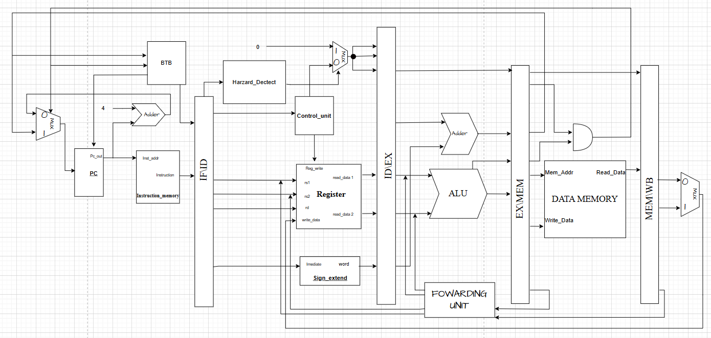

# XÂY DỰNG BỘ XỬ LÝ MIPS 32BIT SỬ DỤNG KỸ THUẬT PIPELINE


## 📖 Giới thiệu (Overview)
Dự án thiết kế vi xử lý MIPS 32-bit với kiến trúc **Pipeline 5 tầng**, tích hợp tính năng nâng cao **Dự đoán rẽ nhánh động (Dynamic Branch Prediction)** để tối ưu hóa hiệu năng xử lý lệnh.

Hệ thống được thiết kế hoàn toàn bằng Verilog và đi kèm với môi trường kiểm thử (Verification) so sánh với Golden Model.

## 🚀 Tính năng kỹ thuật (Technical Features)

### 1. Pipeline Stages
CPU thực thi lệnh qua 5 giai đoạn:
1.  **Fetch (IF):** Lấy lệnh từ bộ nhớ, dự đoán địa chỉ kế tiếp bằng BTB.
2.  **Decode (ID):** Giải mã lệnh, đọc thanh ghi, xử lý nhảy (Jump), phát hiện Hazard.
3.  **Execute (EX):** Tính toán ALU, tính địa chỉ rẽ nhánh (Branch Address).
4.  **Memory (MEM):** Truy cập bộ nhớ dữ liệu (Load/Store), quyết định rẽ nhánh thực tế.
5.  **Writeback (WB):** Ghi kết quả ngược lại thanh ghi.

### 2. Xử lý xung đột (Hazard Handling)
* **Data Hazard:** Giải quyết bằng kỹ thuật **Forwarding** (đẩy dữ liệu từ EX/MEM và MEM/WB về ID/EX).
* **Control Hazard:** Sử dụng **Branch Target Buffer (BTB)** để dự đoán hướng nhảy. Nếu đoán sai, pipeline sẽ được flush tự động.
* **Load-Use Hazard:** Phát hiện và chèn chu kỳ đợi (Stall) tại bộ Hazard Detect.

## 📂 Cấu trúc dự án (Project Structure)

Dựa trên mã nguồn trong thư mục `rtl/`:

### 1. Core Modules (`rtl/`)
| Module | Chức năng |
| :--- | :--- |
| **Top.v** | Module đỉnh, kết nối Data Path và Control Unit. |
| **PC.v** | Bộ đếm chương trình, tích hợp logic chọn địa chỉ (Next PC Logic). |
| **Control_unit.v** | Bộ điều khiển chính, giải mã Opcode tạo tín hiệu điều khiển. |
| **Reg_file.v** | Tập thanh ghi (Register File) 32x32-bit. |

### 2. Branch Prediction Logic
| Module | Chức năng |
| :--- | :--- |
| **Branch_Target_Buffer.v** | Bộ nhớ đệm dự đoán địa chỉ đích và hướng nhảy (Saturating Counter). |
| **Enable_Branch.v** | Logic kiểm tra điều kiện rẽ nhánh thực tế tại giai đoạn MEM. |
| **ALU_Branch.v** | Tính toán địa chỉ đích của lệnh nhánh. |

### 3. Execution & ALU
| Module | Chức năng |
| :--- | :--- |
| **ALU.v** | Bộ tính toán số học và logic chính. |
| **ALU_Control.v** | Giải mã ALUOp và Funct code để điều khiển ALU. |
| **ALU_Pc.v** | Bộ cộng tính PC + 4. |
| **adder_32bit.v** | Module cộng cơ bản 32-bit. |
| **Shift_Left_2.v** | Dịch trái 2 bit (dùng tính địa chỉ nhảy). |
| **Sign_extend.v** | Mở rộng dấu (16-bit to 32-bit). |

### 4. Memory Units
| Module | Chức năng |
| :--- | :--- |
| **Instruction_mem.v** | Bộ nhớ lệnh, nạp file hex chương trình. |
| **Data_mem.v** | Bộ nhớ dữ liệu (RAM). |

### 5. Pipeline Registers & Hazards
| Module | Chức năng |
| :--- | :--- |
| **IF_ID.v** | Thanh ghi đệm giữa Fetch và Decode. |
| **ID_EX.v** | Thanh ghi đệm giữa Decode và Execute. |
| **EX_MEM.v** | Thanh ghi đệm giữa Execute và Memory. |
| **MEM_WB.v** | Thanh ghi đệm giữa Memory và Writeback. |
| **Hazard_detect.v** | Phát hiện Load-Use hazard để stall pipeline. |
| **Forwarding_unit.v** | Điều khiển các Mux để forwarding dữ liệu. |

### 6. Multiplexers (Mux)
* `mux_2x1_32bit.v`, `mux_3x1_32bit.v`: Các bộ dồn kênh dùng chọn nguồn dữ liệu.
* `mux_WB.v`: Mux chọn dữ liệu ghi ngược (từ ALU hoặc Memory).

---

## 🛠 Kiến trúc hệ thống (System Architecture)

### 1. Sơ đồ khối tổng quát (Top-level Block Diagram)
Sơ đồ dưới đây mô tả kết nối giữa CPU, Bộ nhớ lệnh (IM) và Bộ nhớ dữ liệu (DM).



### 2. Thiết kế Datapath chi tiết (Detailed Datapath)
Chi tiết các đường dữ liệu qua 5 tầng pipeline và khối Forwarding Unit.


## 🛠 Hướng dẫn chạy mô phỏng (Simulation Guide)

### Yêu cầu
* **Icarus Verilog** (Compiler)
* **GTKWave** (Waveform Viewer)
* **Python 3** (Để chạy Golden Model verification)

### Các bước thực hiện
1.  **Chuẩn bị chương trình:**
    * Biên dịch code Assembly MIPS sang mã máy (Hex).
    * Lưu file kết quả vào `program.hex`. (File này được `Instruction_mem.v` đọc vào).

2.  **Chạy script kiểm thử:**
    ```bash
    make run
    ```
    * Lệnh này sẽ biên dịch toàn bộ file trong `rtl/` và testbench trong `tb/`.

3.  **Xem dạng sóng:**
    ```bash
    make wave
    ```
    * Mở GTKWave để debug các tín hiệu quan trọng như `PC`, `Instruction`, `Miss_Prediction`, v.v.

## 📝 Tác giả
* **Trần Minh Trí** - *2313626*
* **Nguyễn Lưu Khánh Trình** - *2313638*
